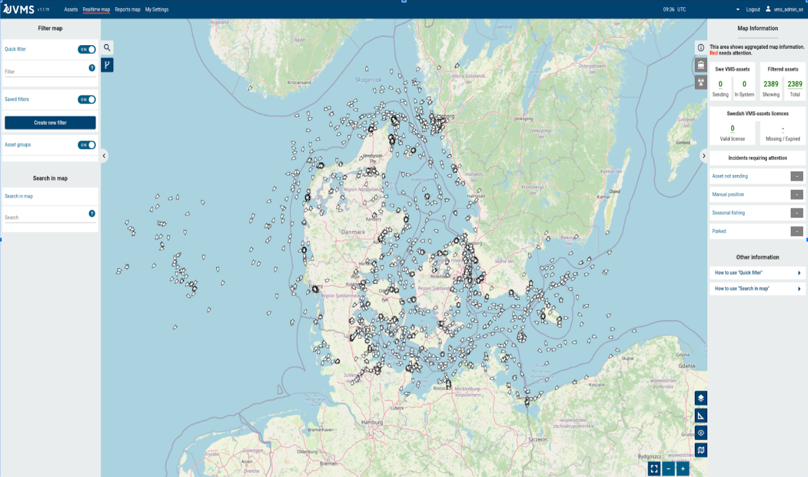

# AIS Server Simulator

A simple [AIS](https://en.wikipedia.org/wiki/Automatic_identification_system) server simulator for an application called [Union Vessel Monitoring System (UVMS)](https://focusfish.atlassian.net/wiki/spaces/UVMS/overview).

Please note: The UVMS application is not contained in this repository. It can however be found [here](https://github.com/UnionVMS/).

# Functionality

This is application a microservice that exposes a HTTP endpoint on port 8040 that streams simulated real-time AIS-data. Multiple external clients can connect to this endpoint and consume AIS-data from it as if it were a real AIS-server. AIS-data is read from a local file.

There is also a simple web UI implemented in HTML and JavaScript from which the simulator can be controlled.

# How to build & run simulator

Build with `mvn clean install`.

Run with `java -jar target/ais-simulator-microbundle.jar`.

After that you can access the web UI from http://localhost:8080.

P.S. In case you don't have any AIS files, you can download one using `wget https://web.ais.dk/aisdata/aisdk-2021-08-01.zip` and then run `unzip aisdk-2021-08-01.zip`.

## Web UI

There is a web UI http://localhost:8080/ which makes it possible to:
- change simulator state:
  - start streaming of AIS data, or resume streaming if stream is currently paused.  
  - stop streaming of AIS data (stop stream and disconnect all currently connected clients) 
  - pause streaming of AIS data (pause stream but retain connection to all currently connected clients)
- make the stream contain only every nth value in the file
- upload new AIS files (.csv datafile)
- select which AIS file is currently being streamed to clients

<b>Screenshot 2</b> - *Administration page of AIS Server Simulator.*

## REST API

The microservice contains a REST API which makes it possible to perform the same operations as from the web UI.

The OpenAPI specification for that REST interface is available at http://localhost:8080/openapi.

There is also Swagger UI available for the REST interface at http://localhost:8080/rest/openapi-ui/.

## Nth position value

In order to reduce the rate at which data is streamed to clients, the AIS-data stream can be made to contain only every Nth position value (e.g. Nth=3 will stream only every 3rd AIS value and Nth=1 will stream every single AIS value).

# Before you press "Start" in web UI

Please note: You can only start up the AIS-simulator from the admin page after you have first done the following:

1. uploaded at least one .csv datafile to the AIS-simulator server
2. selected which datafile the AIS-simulator should read from when it is running.

Both of these things you can do from the AIS-simulator admin page at http://localhost:8080.

After this each client that connects to http://localhost:8040 will be able to receive its own stream of AIS-data.

# Where can I download more AIS datafiles?

Datafiles containing historical AIS messages can be downloaded from https://web.ais.dk/aisdata/.

Each .csv file contains all AIS messages sent during a 24 hour timeperiod (from 00:00 to 23:59) of that specific date/day.

# Implementation

This microservice is a Jakarta EE application built on top of the [MicroProfile](https://microprofile.io) microservice framework. The project is built into a self-sufficient JAR which contains both classes and dependencies needed to run the application. Included in that JAR is [Payara Micro Enterprise](https://www.payara.fish/products/payara-micro/), a Jakarta EE server, in which the application runs.

# High-level overview of simulator interacting with UVMS application

This diagram is meant mainly to describe the operation and implementation structure of the AIS-server simulator. However
it also contains an overly simplified - and thus not completely accurate - model of the UVMS application (in the upper
right-hand corner of the diagram).

<b>Diagram 1</b> - *AIS-server simulator high-level structure. Please note: this is not a UML-diagram.*</b>

# Backround: What is an AIS server and why do we need to simulate its functionality?

Before we answer that we first need to know what AIS messages are.

*[Automatic Identification System](https://en.wikipedia.org/wiki/Automatic_identification_system)* (AIS) messages are
short, automatic, status messages broadcast wirelessly
using [marine VHF radio](https://en.wikipedia.org/wiki/Marine_VHF_radio) from
automatic [AIS transponders](https://en.wikipedia.org/wiki/Automatic_identification_system#/media/File:Ships_AIS_display_with_lists_of_nearby_vessels.jpg)
on pretty much all major ships, boats and other marine vessels. This is done in order to let other vessels, satellites
and landbased stations know their geographic location, course, destination etc. AIS-messages are typically sent out
every 3-180 seconds and have a maximum range of 65
km.

<b>Screenshot 1</b> - *A map showing ships whose positions and bearings have been extracted from AIS messages. Before that the AIS messages themselves were read from the REST interface of an AIS server. Screenshot from browser based frontend of the UVMS application (i.e. not the AIS Server Simulator).* </b>

After a satellite or landbased radio antenna has intercepted an AIS message, the message contents are eventually
forwarded to an "AIS server". An AIS server is a centralized repository of intercepted/recieved AIS messages. Whenever
the AIS server receives a new AIS message it immediatelly rentransmits it to its REST interface. And from this REST
interface, applications that are otherwise unable to receive AIS messages because they lack a marine radio antenna
and are way out of range of the original radio transmission (just like the UVMS application is) are now able to fetch the message more or less in realtime.

Similarly to the AIS server, the simulated AIS server i.e. the *AIS Server Simulator*, is also a server that can send
out AIS messages using a REST interface to other applications. However instead of sending out real AIS messages that
actual boats/vessels have previously sent out, the AIS server simulator instead sends out "fake" AIS messages that it
reads from a local file. This is useful especially when testing an application that uses IAS traffic since you can use
specific set of predefined AIS-messages e.g. when testing some specific marine traffic scenario.

# Unresolved issues:

## Unresolved issues #1

Uploaded files are deleted when OS is rebooted?

Uploaded files are currently stored in `/tmp/uvms`. In Linux this folder and all files contained within it are
automatically deleted once the OS is rebooted.

On Windows this doesn't happen and any uploaded files will remain even after the OS is restarted.

## Unresolved issues #2

This application currently works only in Linux (and Mac?).

In Microsoft Windows you will have to change the path of the temporary download directory from `/temp/uvms` to a path
that works in Windows e.g. `C:\temp\uvms`. That change will have to be made in the following three files:

* /pom.xml
* /src/main/webapp/WEB-INF/web.xml
* /src/main/java/se/havochvatten/unionvms/rest/AisServerState.java

## Unresolved issues #3

Another issue on Windows is that you may get a `java.net.SocketException: Protocol family not supported` thrown by the
JVM if you try to connect (from the client) to url http://localhost:8040/. This issue may be related to running Docker
Desktop.

One way to get around this issue seems to be to make the query to http://[your host computer name]:8040/ instead. So you
could use e.g. http://desktop-25pafta:8040/ if your host computer was named `desktop-25pafta`.

This issue seems to not be present on Linux.

# Future development

Create a docker image for this simulator that runs in e.g. Arch linux so that we can avoid the complications that occur
when running the project in different operating systems, in particular Microsoft Windows.
