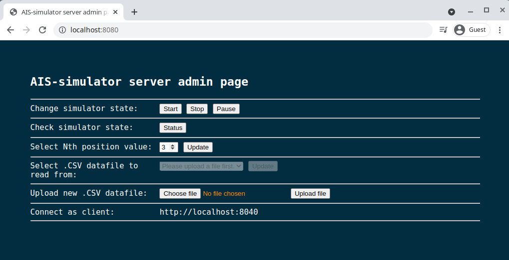

# AIS Simulator

A simple AIS server simulator.

Build with `mvn clean install`, this creates a fat jar with embedded Payara Micro Enterprise server.

Run with `java -jar target/ais-simulator-microbundle.jar`.

After that open http://localhost:8080/ in your web browser. This will display the "*AIS-simulator admin page*" (see screenshot below) where you can do the following:

* select which .csv datafile AIS-simulator should use when it is running
* upload new .csv datafiles to the simulator
* start, stop and pause the AIS-simulator
* select which nth value the simulator should use when it is running

Please note: You can only start up the AIS-simulator from the admin page after you have first done the following:

1. uploaded at least one .csv datafile to the AIS-simulator server
2. selected which datafile the AIS-simulator should read from when it is running.

Both of these things you can do from the AIS-simulator admin page at http://localhost:8080/.

CSV datafiles can be downloaded from [ftp://ftp.ais.dk/ais_data/](ftp://ftp.ais.dk/ais_data/) using e.g. the [FileZilla client](https://filezilla-project.org/).

Once the AIS-simulator is up and running clients can connect to it using port 8040 e.g. http://localhost:8040/.

The admin page for the AIS-simulator server uses a REST interface to communicate with/configure the AIS-simulator server itself. The OpenAPI specification for that REST interface is available at http://localhost:8080/openapi.

# Unresolved issues

This application currently only works in Linux (and Mac?).

On Windows you will have to change the path of the temporary download directory from `/temp/uvms` to a path that works in Windows e.g. `C:\temp\uvms`. That change will have to be made in the following three files:

* /pom.xml
* /src/main/webapp/WEB-INF/web.xml
* /src/main/java/se/havochvatten/unionvms/rest/AisServerState.java

# Extra

There is also Swagger UI available for the REST interface at http://localhost:8080/rest/openapi-ui/.
