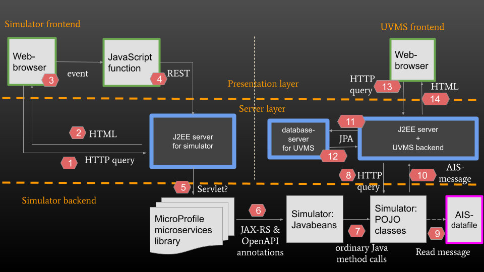
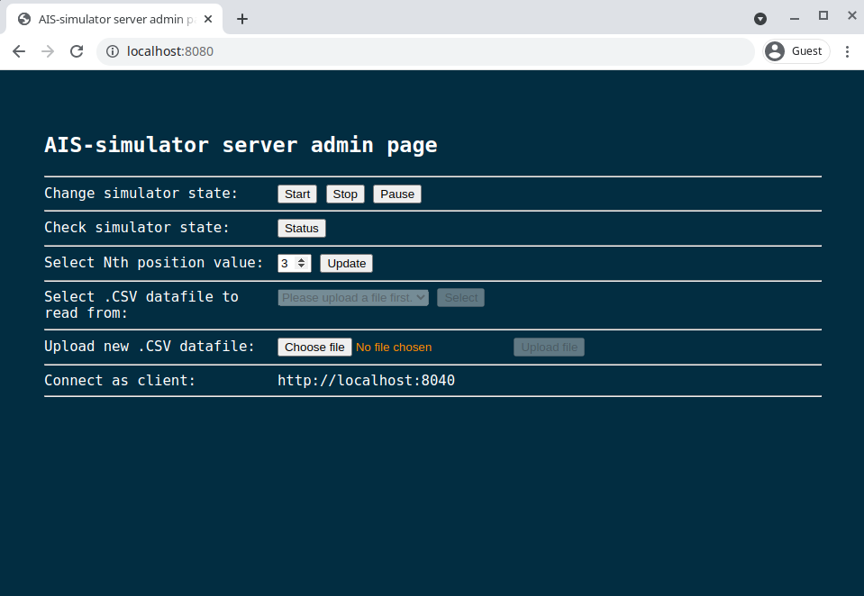

# AIS Server Simulator

A simple AIS server simulator for
the [Union Vessel Monitoring System (UVMS)](https://focusfish.atlassian.net/wiki/spaces/UVMS/overview).

This AIS-server simulator provides
simulated [AIS-messages](https://en.wikipedia.org/wiki/Automatic_identification_system) to the UVMS application.

The AIS-server simulator has a simple administration page (see screenshot below) from which the simulator can be
controlled.

The UVMS application is a completely separate project ([GitHub link](https://github.com/UnionVMS/)) and is not contained
within this repository.

# More background: What is the AIS-simulator and what is it used for?

Automatic Identification System (AIS) messages are short automatic status messages broadcast from automatic transponders
on ships, boats and other marine vessels using radiowaves (Marine VHF). This is done in order to let other vessels,
satellites and landbased stations know their geographic location, course, destination etc. AIS-messages are typically
sent out every 3-180 seconds and have a maximum range of 65 km.

An AIS server is a repository for retransitting such AIS messages, in near realtime, typically via a REST interface to
applications that are otherwise unable to receive AIS messages (they don't have an antenna or are out of range of the
original transmission).

This AIS server simulator is similarily a server that can send out AIS messages using a REST interface to other
applications. However instead of sending out real AIS messages that actual boats/vessels have previously sent out, the
AIS server simulator instead sends out "fake" AIS messages that it reads from a local file. This is useful especially
when testing an application that uses IAS traffic since you can use specific set of predefined IAS-messages e.g. when
testing some specific marine traffic scenario.

# High-level overview of simulator interacting with UVMS application

This diagram is meant mainly to describe the operation of the AIS-server simulator. However it also contains an overly
simplified - and thus not completely accurate - model of the UVMS application (in the upper right-hand corner of the
diagram).

<b>Diagram 1</b> - AIS-server simulator high-level structure. Please note: this is not a UML-diagram.</b>

# How to build & run

Build with `mvn clean install`, this creates a fat jar with embedded Payara Micro Enterprise server.

Run with `java -jar target/ais-simulator-microbundle.jar`.

# How to access administration page

After that open http://localhost:8080/ in your web browser. This will display the "*AIS-simulator admin page*" (see
screenshot below) where you can do the following:

* select which .csv datafile AIS-simulator should use when it is running
* upload new .csv datafiles to the simulator
* start, stop and pause the AIS-simulator
* select which nth value the simulator should use when it is running

<b>Screenshot 1</b> - AIS-server simulator administration page.

# Before you press "Start"

Please note: You can only start up the AIS-simulator from the admin page after you have first done the following:

1. uploaded at least one .csv datafile to the AIS-simulator server
2. selected which datafile the AIS-simulator should read from when it is running.

Both of these things you can do from the AIS-simulator admin page at http://localhost:8080/.

# Where to get .csv datafiles for the simulator

CSV datafiles can be downloaded from [ftp://ftp.ais.dk/ais_data/](ftp://ftp.ais.dk/ais_data/) using e.g.
the [FileZilla client](https://filezilla-project.org/).

# Connecting to simulator from client

Once the AIS-simulator is up and running clients can connect to it using port 8040 e.g. http://localhost:8040/.

# Uploaded files are deleted when OS is rebooted?

Uploaded files are currently stored in `/tmp/uvms`. In Linux this folder and all files contained within it are
automatically deleted once the OS is rebooted.

On Windows this doesn't happen and any uploaded files will remain even after the OS is restarted.

# REST interface

The admin page for the AIS-simulator server uses a REST interface to communicate with/configure the AIS-simulator server
itself. The OpenAPI specification for that REST interface is available at http://localhost:8080/openapi.

There is also Swagger UI available for the REST interface at http://localhost:8080/rest/openapi-ui/.

# Unresolved issues #1

This application currently works only in Linux (and Mac?).

In Microsoft Windows you will have to change the path of the temporary download directory from `/temp/uvms` to a path that works
in Windows e.g. `C:\temp\uvms`. That change will have to be made in the following three files:

* /pom.xml
* /src/main/webapp/WEB-INF/web.xml
* /src/main/java/se/havochvatten/unionvms/rest/AisServerState.java

# Unresolved issues #2

Another issue on Windows is that you may get a `java.net.SocketException: Protocol family not supported` thrown by the
JVM if you try to connect (from the client) to url http://localhost:8040/. This issue may be related to running Docker
Desktop.

One way to get around this issue seems to be to make the query to http://[your host computer name]:8040/ instead. So you
could use e.g. http://desktop-25pafta:8040/ if your host computer was named `desktop-25pafta`.

This issue seems to not be present on Linux.

# Future development

Create a docker image for this simulator that runs in e.g. Arch linux so that we can avoid the complications that 
occur when running the project in different operating systems, in particular Microsoft Windows.
